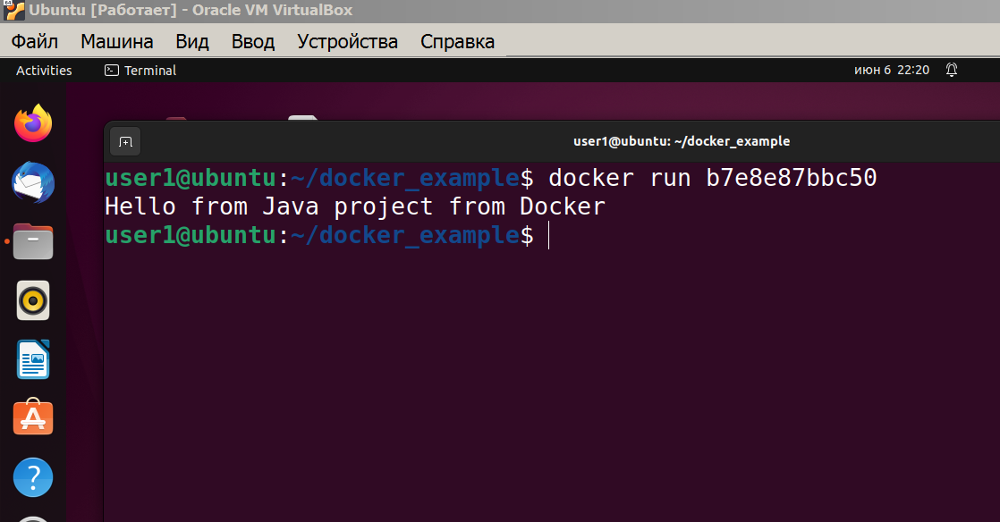

<h3> Пример работы с Docker  </h3>
Описание: Показываем возможности Docker в проекте Java.  
Самым важным в этом проекте будет не сам проект, а порядок работ по  
использованию Docker. В данном случае мы используем связку Java + Maven.   
Проект может быть полезен для Java разработчиков, начинающих Docker. 
Вы можете свободно использовать его для своих экспериментов.   

Примечание: информация о проекте

Большая часть информация о проекте: примечания, описания, 
объяснения, картинки, комментарии   
находятся в папке <b><a href="01_info">01_info</a></b>. 

<a href="/01_info/010_create_project/CREATE_PROJECT.md">010 Создаем проект</a>  
Информация о создании нового проекта, плагин maven-shade-plugin в pom.xml   

<a href="/01_info/020_dockerfile/DOCKERFILE.md">020 Dockerfile</a>  
Создаем и работаем с файлом Dockerfile   

Система, на которой происходит создание и использование образа Docker  
~ на системе установлен Windows 7 x64  
~ на Windows установлен Oracle VirtualBox 7   
~ на VirtualBox  установлен Ubuntu 22.04.2 LTS  

<a href="/01_info/030_ubuntu/UBUNTU.md">030 Ubuntu</a>  
Продолжаем работу с проектом в Ubuntu, собираем образ   

<b>Тестируем получившийся образ</b>  

Проверяем, что образ создался 

<pre>
user1@ubuntu:~/docker_example$ docker images
REPOSITORY       TAG       IMAGE ID       CREATED             SIZE
docker_example   latest    b7e8e87bbc50   About an hour ago   755MB
openjdk          latest    71260f256d19   3 months ago        470MB
openjdk          17        5e28ba2b4cdb   13 months ago       471MB
hello-world      latest    feb5d9fea6a5   20 months ago       13.3kB
</pre> 

Запускаем образ
<pre>
user1@ubuntu:~/docker_example$ docker run b7e8e87bbc50
Hello from Java project from Docker
</pre>

 

